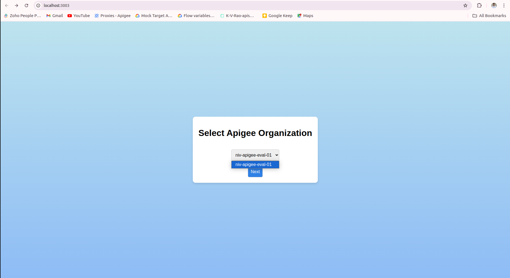
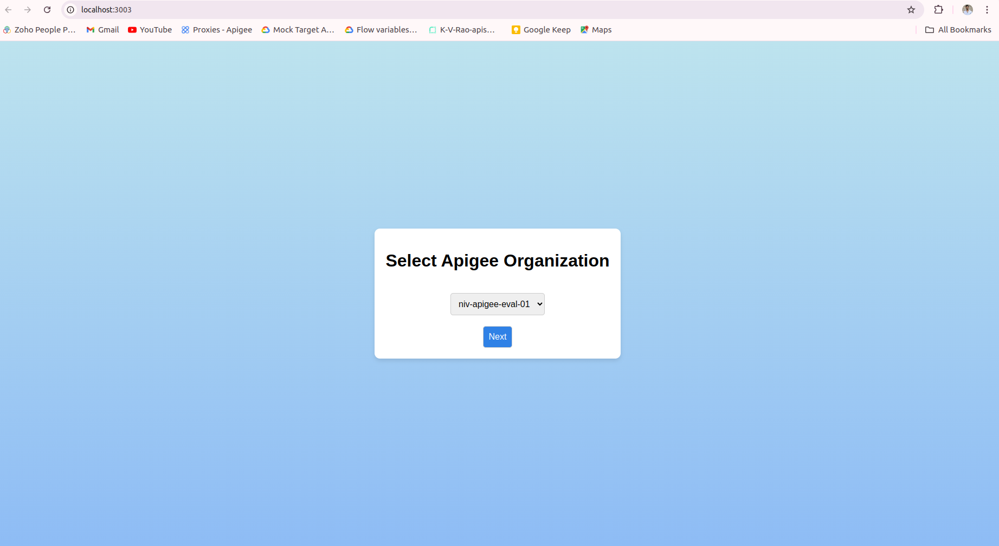
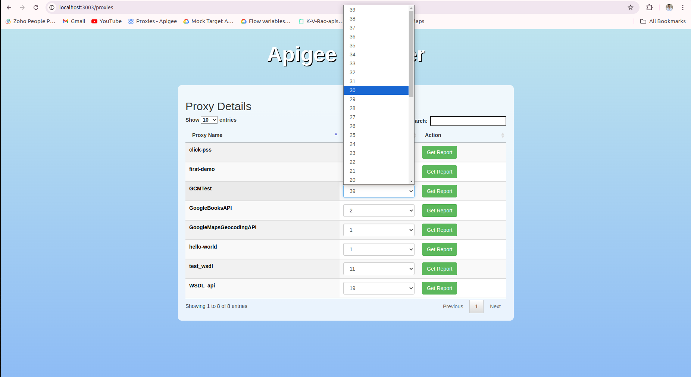
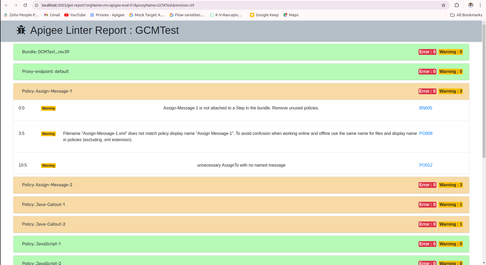

# Apigee Scanner Tool

The Apigee Scanner Tool provides a user-friendly interface to scan your Apigee proxy and generate a linting report for selected revisions. This helps ensure your proxies follow Apigee's best practices. (Support for SharedFlow scanning is coming soon.) The tool also integrates with Apigee's UI for better visualization and understanding.

## Features

- Scan Apigee proxy revisions for best practice compliance
- Generate a linting report for the selected revision
- Redirect to Apigee UI for a detailed view

## Prerequisites

Before using the tool, ensure you have the following installed and configured:

- **Node.js** (version 20)

  - [How to install Node.js on Ubuntu](https://github.com/nodesource/distributions/blob/master/README.md#installation-instructions)

- **gcloud CLI** (authenticated with default authentication)
  - [How to install Google Cloud SDK on Ubuntu](https://cloud.google.com/sdk/docs/install)
  - Run the following command to log in after installation:
    ```bash
    gcloud auth application-default login
    ```

## Installation and Setup

1. Clone the project repository:

   ```bash
   git clone <your-repo-url>
   ```

2. Navigate into the project directory:

   ```bash
   cd apigee-scanner
   ```

3. Install the required dependencies:

   ```bash
   npm install
   ```

4. Start the project:
   ```bash
   npm start
   ```

## Usage

- After starting the project, your default web browser will open automatically.
- You will see a list of all Apigee organizations that you have access to.

    

- Select the organization and click "Next" to proceed.

    

- A list of proxies in your selected organization will be displayed. Select a proxy and revision to generate the linting report.

    

### Linting Report

- After selecting a proxy revision, a linting report will be generated showing any deviations from Apigee's best practices.

    

## Coming Soon

- SharedFlow scanning support
- Custom Scanning Report

## License

This project is licensed under the MIT License.
